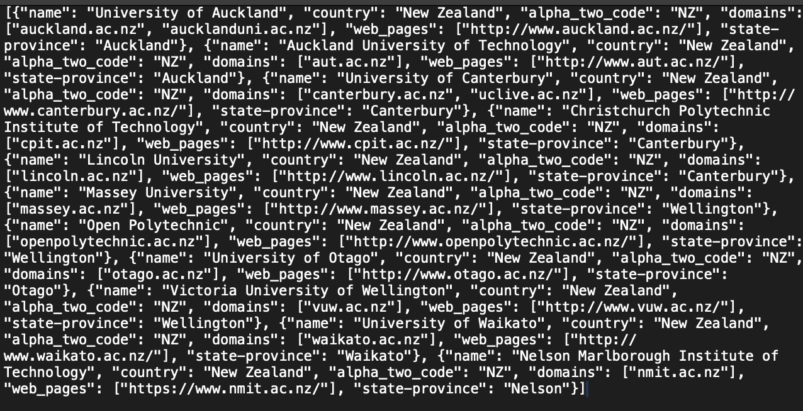
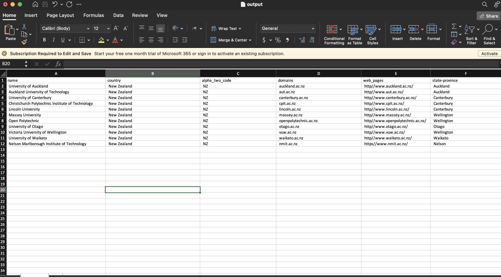
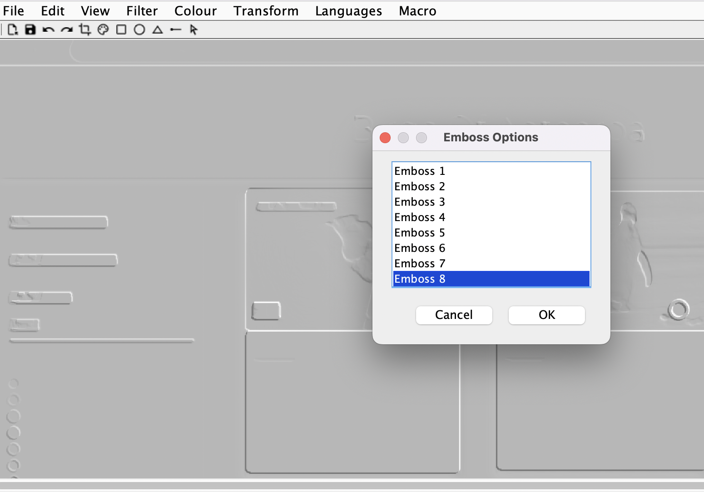
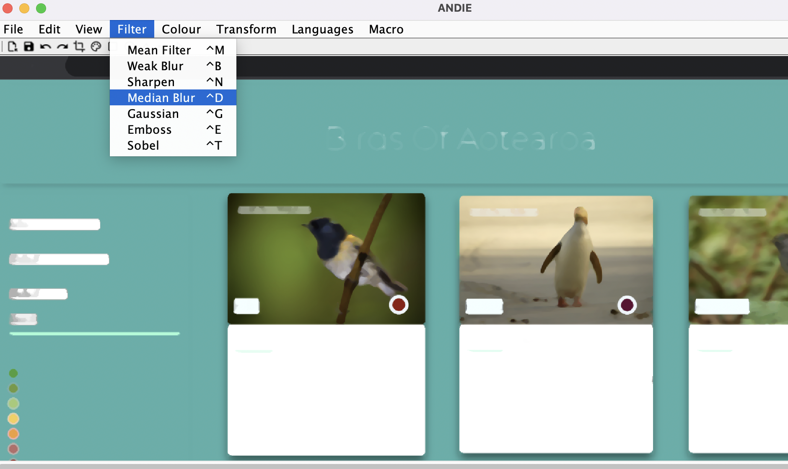
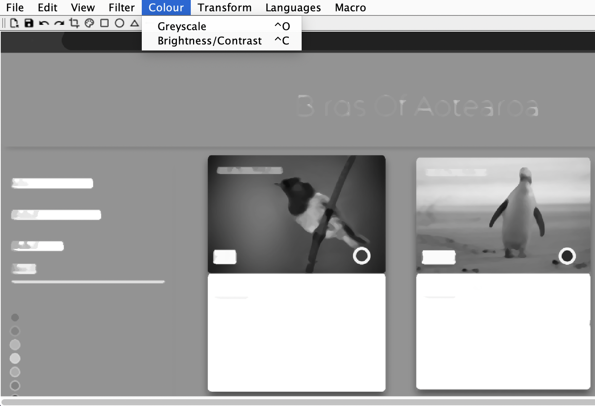
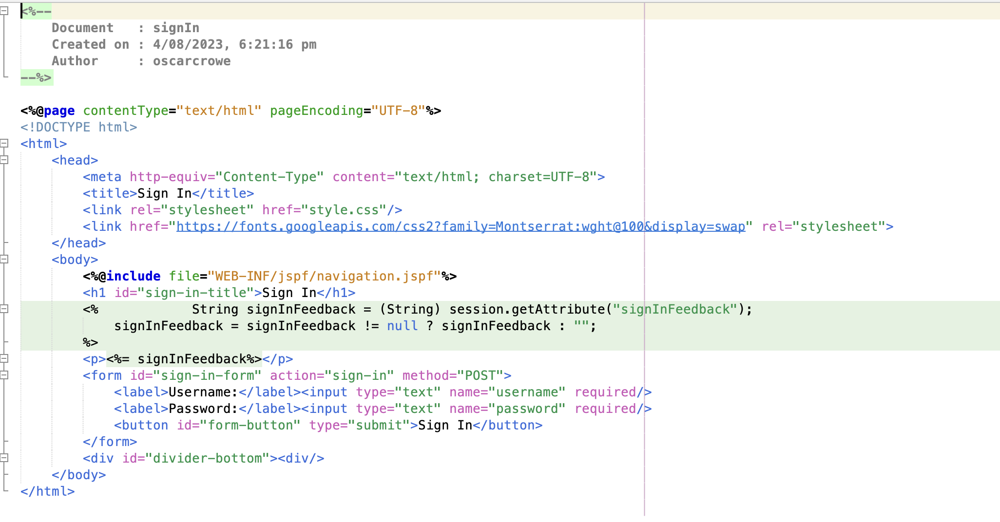
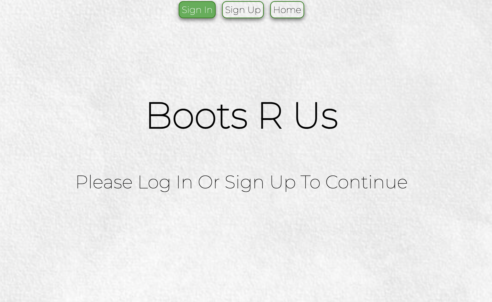
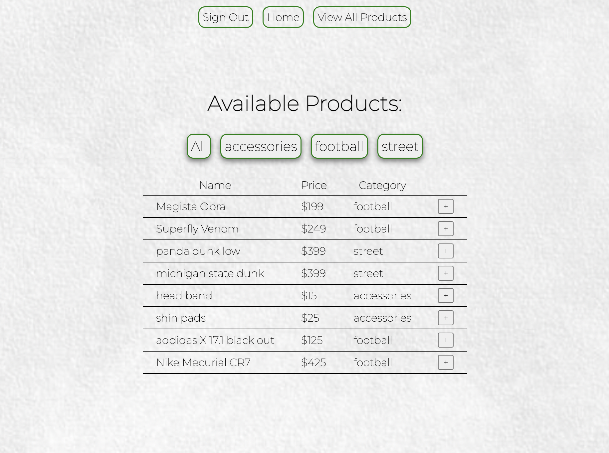
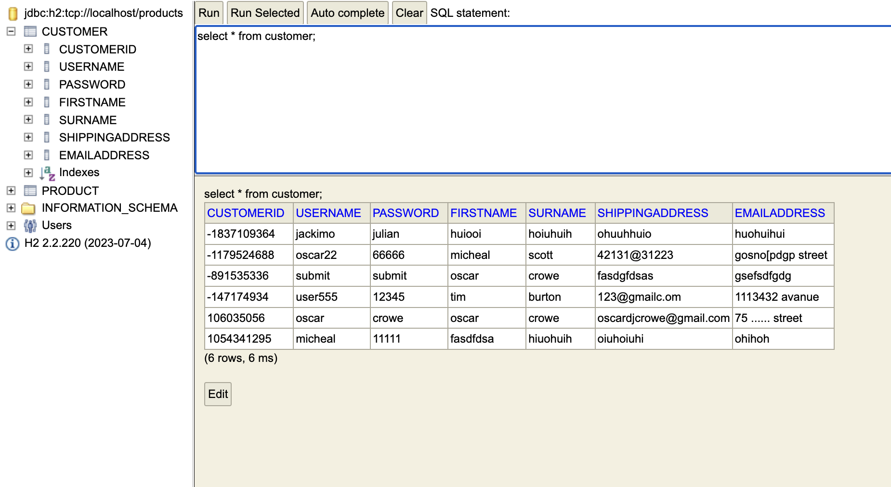
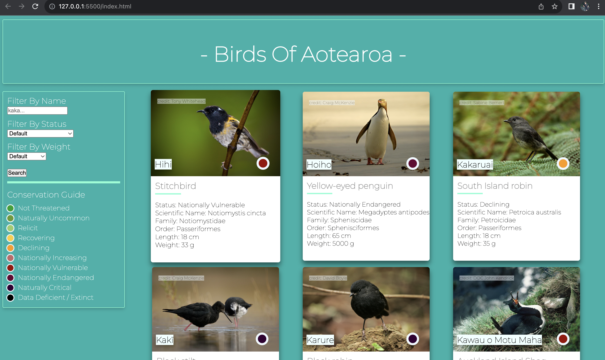

<title>Portfolio</title>

# Bio:
- My Name Is Oscar and I'm currently a second year computer and information science student at Otago. Below are my main projects I've worked on both in and out of University aswell as what tools were used to make them. The main areas I focus in are Java Development, Web Development (HTML, CSS, JS), Back end development with DB's and SQL, Data wrangling and analysis with python and pandas, and a keen focus on lower level concepts working in 6809 assembley, aswell as comftorble use of the terminal, git, pipleines and code test automation.

# Projects:

---

### JSON to CSV convetter
- <strong>Tools Used:</strong> The program runs in java and uses basic test API's availible on the web to take in HTTP get requests in the form of JSON and then parse through it to convert the data into a csv format. This allows you to interogate the JSON data directly in google sheets or excel in a human readable format. All that is required of the user is to plug in the desired URI and then program will place the resulting request in a csv file which you are able to name in the same working directory.
- <strong>Bugs:</strong> Currently the program struggles to handle multi valued inputs. E.g in the example json below Universities can have multiple websites notated with [web1, web2] but the program will only show web1 on the csv file and ignore web2.

<strong>Before:</strong>

<strong>After:</strong>
 

### Algorithm Visualizer
- <strong>Tools Used:</strong> Java threads.
- A Java program that uses multi threading in order to graphically update the proccess of different sorting algorithms. I had taken a paper on data structures and algorithms and always saw videos of visual sorting algorithms so I wanted to try make one myself

### Photo Editor
- <strong>Tools Used:</strong> Java was used to develop the entire application.
- The largest project I've worked on is this non destructive photo editor. The project was group based and foccused heavily on CI/CD pipelines and git integration. We had automated tests running to make sure the program was fucntioning correctly. Using java I developed image proccessing classes, different filters, drawing tools and kernel opperations. The tool can access files on your computer to load in and perform opperations on them. Files that have been altered can then be saved locally and worked on later. Overall the entire project contained approximatley 35 files which helped me develop skills to manage larger tasks.

|  |  |
|----------|----------|
|  |  |

 

### Full Stack Mock Shoe Store
- <strong>Tools Used:</strong> The app uses server side rendering to allow the site to load user specific content. This is done using .JSP and java .Servelt files to dynamiccly inject java into the html files the web page loads. The data base is hosted on H2 and the java servlets utilize DAO's to query and return information using SQL about user details, stock and http sessions. The website has very minimal styling becuase of the focus on its back end however css was used to syle the components that are there.
- <strong>Testing:</strong> The app uses hamcrest and junit to provide testing on the DAO classes to make sure data is being written and retrieved correctly in the DB. Furthermore the site provides dynamic feedback to the user if the details they enter are incorrect or violate a constraint.

|  |  |
|----------|----------|
|  |  |
|  |  |

### NZ Bird Website:
- <strong>Tools Used:</strong> CSS for styling of the webpage, HTML for structure, JS for dynamic loading of content, taking user input and reading in JSON data.
- A website that contains a data base of NZ birds that can be filtered to the users preference. All the filtering and search functions are done in JS and allow the page to load and delete components depending on user input. 

### Front End Nike Website Mock Up:
- <strong>Tools Used:</strong> CSS for styling of the webpage, HTML for structure.
- This was one of my early projects focussing on front end development and how web pages are constructed.

