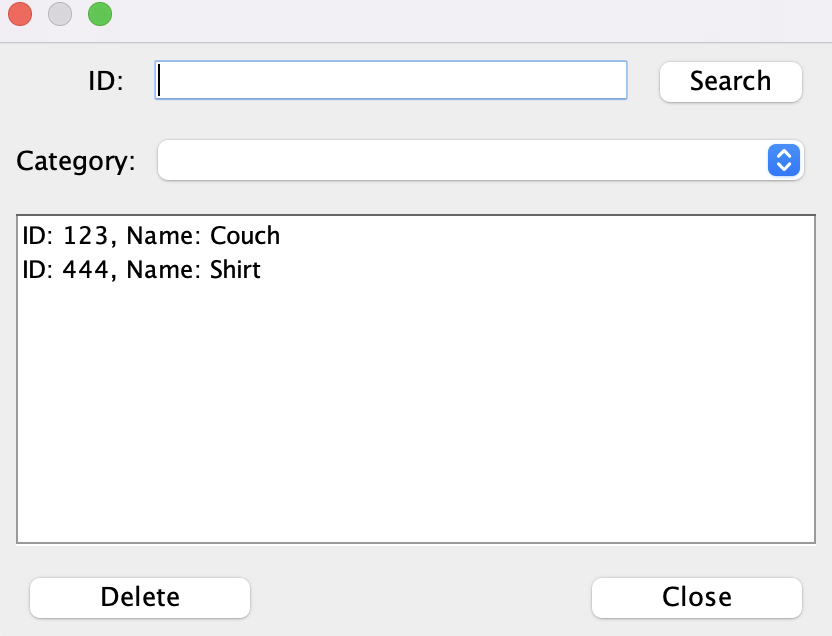

<title>Portfolio</title>

# Bio:
- My Name Is Oscar and I'm currently a second year computer and information science student at Otago. Below are my main projects I've worked on both in and out of University aswell as what tools were used to make them. The main areas I focus in are Java Development, Web Development (HTML, CSS, JS), Back end development with JSP and Servlets, Data wrangling and analysis with python and pandas, and a keen focus on lower level concepts working in 6809 assembley.

# Projects:

---

### Front End Nike Website Mock Up:
- <strong>Tools Used:</strong> CSS for styling of the webpage, HTML for structure.
- This was one of my early projects focussing on front end development and how web pages are constructed.

### NZ Bird Website:
- <strong>Tools Used:</strong> CSS for styling of the webpage, HTML for structure, JS for dynamic loading of content, taking user input and reading in JSON data.
- A website that contains a data base of NZ birds that can be filtered to the users preference. All the filtering and search functions are done in JS and allow the page to load and delete components depending on user input. 

### Photo Editor
- <strong>Tools Used:</strong> Java was used to develop the entire application, GIT CI/CD > Pipelines in yaml, JUnit Testing.
- The largest project I've worked on is this non destructive photo editor. The project was group based and foccused heavily on CI/CD pipelines and git integration. We had automated tests running to make sure the program was fucntioning correctly. Using java I developed image proccessing classes, different filters, drawing tools and kernel opperations. Overall the entire project contained approximatley 35 files which helped me develop skills to manage larger tasks.

### Back End For Online Store
- <strong>Tools Used:</strong> Java Swing GUI's, H2 DB to hold data, Java code to read and send queries.
- Built a product catalogue that runs behind an online shop that allows you to add and remove products. 

### Algorithm Visualizer
- <strong>Tools Used:</strong> Java threads.
- A Java program that uses multi threading in order to graphically update the proccess of different sorting algorithms. I had taken a paper on data structures and algorithms and always saw videos of visual sorting algorithms so I wanted to try make one myself

